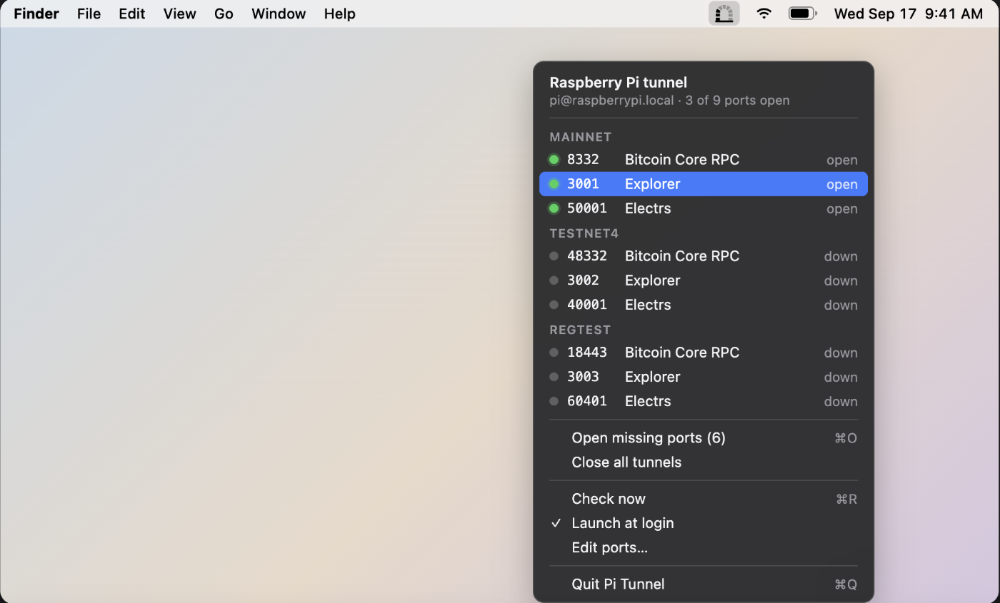
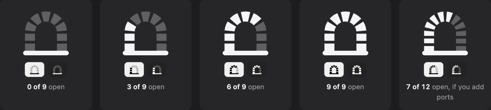
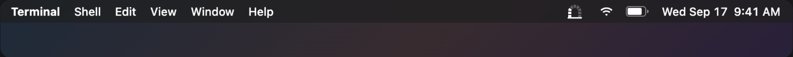

# Pi Tunnel

Pi Tunnel is a macOS menu bar app that watches an SSH port-forwarding tunnel to a Raspberry Pi (or any host) and shows you, at a glance, which ports are open. The menu bar icon is a brick arch — one brick per port, lit when the tunnel for that port is actually up. Click the icon to see every port's status, open the ones that are down, or jump straight to a service in your browser.



The icon at 0, 3, 6 and 9 of 9 ports open, plus 7 of 12 if you add ports. Each tile shows the zoomed glyph and the real menu bar size on light and dark:





## Why a tunnel instead of connecting directly?

You could open each service's port on the Pi and point your Mac at `raspberrypi.local:<port>`. An SSH tunnel is usually the better deal:

- **Services stay private.** Things like a node's RPC, a database or an admin UI can keep listening on `127.0.0.1` on the Pi. Nothing new is exposed on the LAN, and there is no firewall rule per service to get right.
- **One door, already locked.** The only thing reachable over the network is SSH, which you have already secured with a key. Every service behind it inherits that.
- **Encrypted in transit.** Many of these services speak plain HTTP with basic auth or no auth at all. Inside the tunnel that traffic is encrypted; on the LAN it would not be.
- **Your apps never change.** Everything on the Mac talks to `127.0.0.1:<port>`. Move the Pi, change its IP, reach it over a VPN or a jump host, and only the ssh host changes.
- **The tunnel is the whole story.** If it is up, everything works; if it is down, nothing does. That single fact is what Pi Tunnel puts in the menu bar.

The trade-off is that the tunnel has to be up before anything else works, and forgetting that is what this app exists to fix.

## Install

1. Download the latest zip from [GitHub Releases](https://github.com/ByteApps/pi-tunnel/releases/latest).
2. Unzip it and drag **Pi Tunnel.app** into `/Applications` (or `~/Applications`).
3. Open it. The app is signed with a ByteApps LLC Developer ID and notarized by Apple, so it opens without warnings.

## Requirements

- macOS 13 or later.
- Passwordless, key-based SSH to your host already working from Terminal. Pi Tunnel runs `ssh` in batch mode, so it can never answer a password, passphrase, or host-key prompt.

Check this before opening the app:

```
ssh -o BatchMode=yes pi@raspberrypi.local true
```

If that prints nothing and exits `0`, Pi Tunnel will work. If it prompts for anything or fails, fix your SSH setup first (load your key, add the host to `known_hosts`, confirm the key has no passphrase or is loaded in an agent).

## Configure

Choose **Edit Ports…** from the menu. The window shows the SSH host, how often to check, and a table of every port with its group, number, service name and an optional URL. Click a cell to change it, use **+** and **−** to add or remove rows, then **Save**. The menu and the icon update immediately.

- Ports in the same group are listed together in the menu, so name groups after whatever makes sense on your Pi: a chain, a service, a room.
- A row with a URL opens it in your browser when clicked. Rows without one copy `127.0.0.1:<port>` to the clipboard.
- Save checks that ports are 1–65535 and unique, that groups and service names are filled in, and that a URL has a scheme. Problems are shown in the window and nothing is written.
- **Cancel** closes without changes. **Open JSON File…** opens the underlying file, `~/.config/pi-tunnel/ports.json`, if you prefer a text editor. The app re-reads it on the next check.

### Example: a Bitcoin node on a Pi

Three groups, nine ports, a nine-brick icon:

| Group | Port | Service | URL |
|---|---|---|---|
| mainnet | 8332 | Bitcoin Core RPC | |
| mainnet | 3001 | Explorer | http://127.0.0.1:3001 |
| mainnet | 50001 | Electrs | |
| testnet4 | 48332 | Bitcoin Core RPC | |
| testnet4 | 3002 | Explorer | http://127.0.0.1:3002 |
| testnet4 | 40001 | Electrs | |
| regtest | 18443 | Bitcoin Core RPC | |
| regtest | 3003 | Explorer | http://127.0.0.1:3003 |
| regtest | 60401 | Electrs | |

## How it decides a port is open

Every `intervalSeconds`, Pi Tunnel:

1. Makes a non-blocking TCP connect to `127.0.0.1:<port>` for each registered port (no data sent, 1.5 s timeout).
2. Runs `lsof -nP -iTCP -sTCP:LISTEN` once to see who owns each listening port.

Then, per port:

- **Connect succeeds, owner is `ssh`** → open. Brick lit, green dot.
- **Connect succeeds, owner is something else** → busy, not a tunnel. Brick unlit, orange dot, labeled "busy, not ssh".
- **Connect fails** → down. Brick unlit, grey dot.

The arch's road is always drawn solid; only the bricks change. The icon is a template image, so it adapts automatically to light and dark menu bars.

## Menu actions

- **Header** — shows the host and "N of M ports open".
- **Port rows** — grouped by group name. Click a row with a `url` to open it in your browser; click any other row to copy `127.0.0.1:<port>` to the clipboard.
- **Open missing ports (n)** (⌘O) — runs `ssh -f -N -o ExitOnForwardFailure=yes -o BatchMode=yes -o ConnectTimeout=10 -L <port>:127.0.0.1:<port> …` with a `-L` flag for each port that's currently down, so ports already in use don't abort the connection.
- **Close all tunnels** — sends `SIGTERM` to the `ssh` processes that own listeners on your registered ports.
- **Check now** (⌘R) — runs a check immediately instead of waiting for the next interval.
- **Show count in menu bar** — off by default; toggles a text label like "3/9" next to the icon.
- **Launch at login** — uses `SMAppService` (system login items). The app needs to live in `/Applications` or `~/Applications` for this to work.
- **Edit Ports…** — opens the ports window described under Configure.
- **More from ByteApps…** — opens byteapps.com.
- **Quit Pi Tunnel** (⌘Q).

## Build from source

Requires Xcode or the Command Line Tools. No external dependencies — plain Swift + AppKit.

```
./build.sh              # builds build/Pi Tunnel.app (universal: arm64 + x86_64)
./build.sh --install    # also installs to ~/Applications and launches it
./build.sh --release    # produces build/Pi-Tunnel-<version>.zip
```

Official releases are signed and notarized. To do the same for your own build, set:

- `SIGN_IDENTITY` — a "Developer ID Application: …" identity in your keychain.
- `NOTARY_PROFILE` — a `notarytool` keychain profile (`xcrun notarytool store-credentials`).

## Support

If this app is useful to you, a small bitcoin donation to ByteApps LLC is always appreciated — entirely optional.

<div align="center">


**`bc1qkmg7qek6vuuw6hqp9sm06krzcr7pwd5jhcr43f`**

</div>

Donations help cover development costs and keep more open-source tools coming. No VC funding, no ads, no tracking.

## License

MIT. See [LICENSE](LICENSE).
